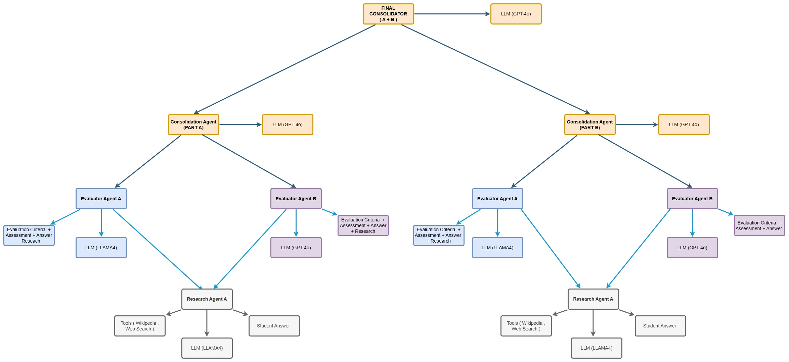

# 🏋️‍♂️ POC: Physical Education Teacher Exam Evaluation (Spain)

## 📑 Table of Contents

- [🧠 Evaluation Logic](#-evaluation-logic)
- [📊 Assessment Scoring Breakdown](#-assessment-scoring-breakdown)
- [🤖 AI Evaluation Agent](#-ai-evaluation-agent)
- [ Agent Arquitecture ](#agent-arquitecture)
- [ LangGraph WorkFlow ](#langgraph-workflow)
- [💰 Token Costs](#token-costs)

## 🧠 Evaluation Logic

This project is based on official evaluation criteria used in education exams. It covers:

- **Part A: Practical Case Studies**  
  Includes a problem statement with 2 scenarios and student-written responses to realistic scenarios.

- **Part B: Topic Development Essay**  
  Includes student essays based on a given topic.

Both parts are evaluated using **well-defined scoring rubrics** (evaluation criteria)

## 📊 Assessment Scoring Breakdown

| **Exam Section** | **Description**         | **Max Points** |
| ---------------- | ----------------------- | -------------- |
| **Part A**       | Practical Case Studies  | 10             |
| **Part B**       | Topic Development Essay | 10             |

## 🤖 AI Evaluation Agent

The evaluation criteria have been encoded into an **AI Agent** capable of:

- Reading student responses from scanned handwritten images
- Evaluating them against official rubrics
- Assigning structured scores across each dimension
- Providing auto-generated feedback for improvement

This enables fast and scalable correction of handwritten exams using Multimodal LLMs (Large Language Models).

## Agent Arquitecture



## 💰 Token Costs

Estimated usage and cost per section when evaluating real examples:

### Part A - Practical Cases

```json
{
  "prompt_tokens": 14814,
  "completion_tokens": 3300,
  "total_tokens": 18114,
  "total_cost": 0.070035,
  "cached_tokens": 0,
  "reasoning_tokens": 0
}
```

### Part A - Extract statements

```json
{
  "prompt_tokens": 1131,
  "completion_tokens": 337,
  "total_tokens": 1468,
  "total_cost": 0.0061975,
  "cached_tokens": 0,
  "reasoning_tokens": 0
}
```

### Part B - Essay

```json
{
  "prompt_tokens": 20469,
  "completion_tokens": 3257,
  "total_tokens": 23726,
  "total_cost": 0.0837425,
  "cached_tokens": 0,
  "reasoning_tokens": 0
}
```

### AGENT

```json
{
  "prompt_tokens": 34931,
  "completion_tokens": 4738,
  "total_tokens": 39669,
  "total_cost": 0.0755575,
  "cached_tokens": 0,
  "reasoning_tokens": 0
}
```

> 🧪 _This POC demonstrates how AI can assist in the evaluation of competitive exams by automating correction and ensuring scoring consistency._
