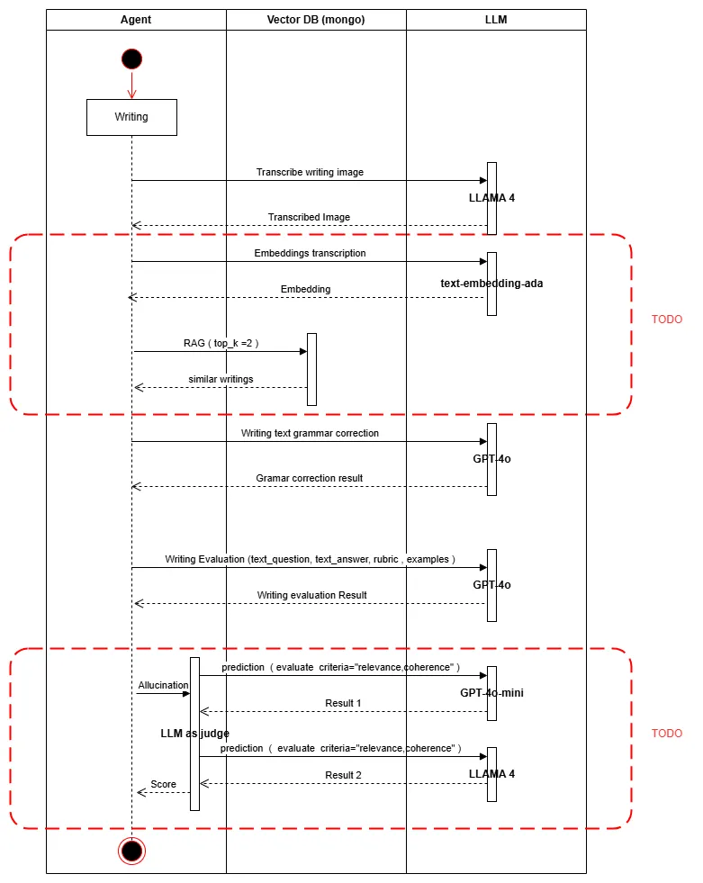
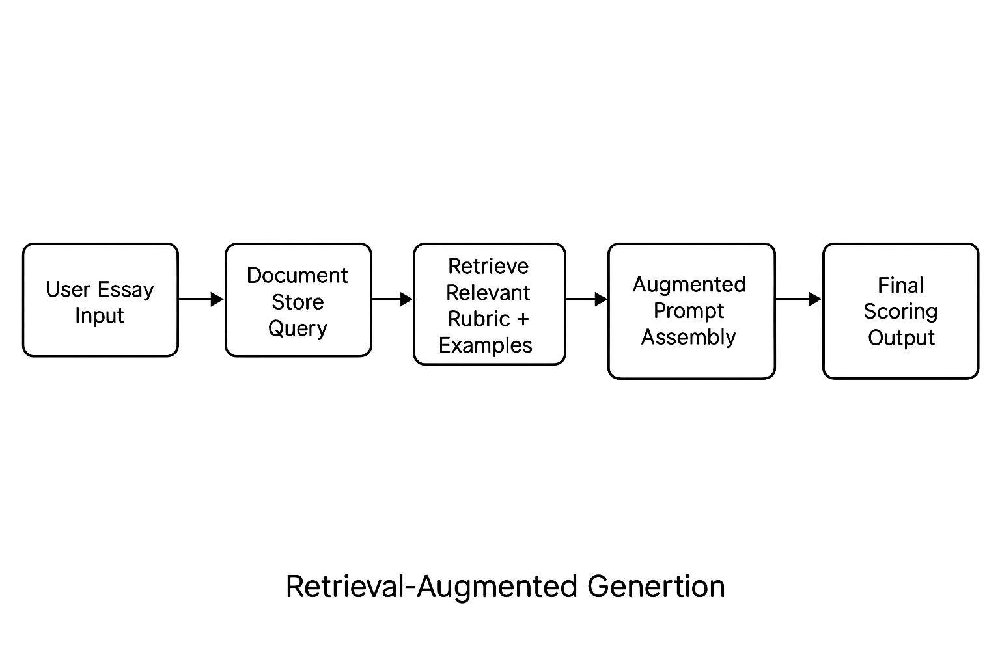
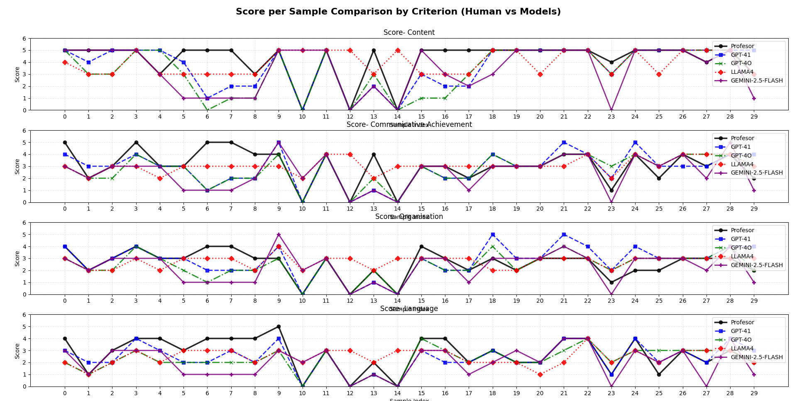
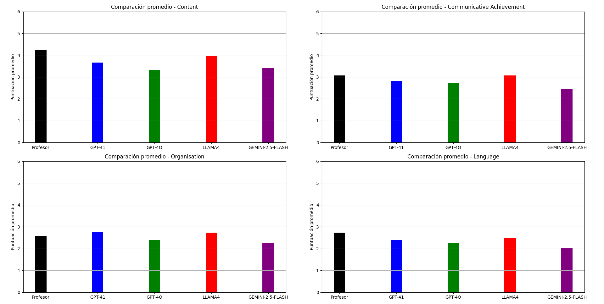
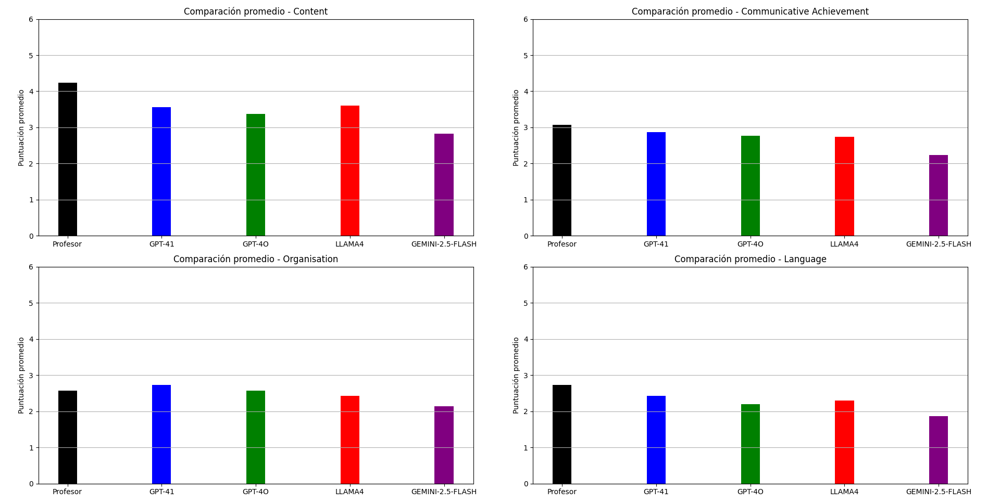

# Mockhat AI Engineering

A unified architecture for continuous learning with LLMs in education.
🚧 Under heavy development! 🚧

## 📚 Table of Contents

- [Overview](#overview)
- [AI Engineering Stack](#ai-engineering-stack)
- [AI Agent Architecture](#ai-agent-architecture)
- [Prompt Engineering](#prompt-engineering)
- [Retrieval-Augmented Generation (RAG)](#retrieval-augmented-generation-rag)
- [Security](#security)
- [LLM Benchmark](#llm-benchmark)
- [Model Evaluation](#model-evaluation)
- [Training](#training)
- [TODO](#todo)
- [License](#license)
- [Contact](#contact)

## Overview

**Mockhat AI** is an AI-driven platform designed to assess English writing proficiency. It transcribes handwritten essays from images and evaluates them using customizable rubrics. By integrating advanced AI models and frameworks, Mockhat AI aims to provide accurate, consistent, and insightful feedback to educators and students alike.

### Key Features

- Retrieval-Augmented Generation (RAG): Enhances response accuracy by retrieving relevant information and context.
- Embeddings: Utilizes OpenAI’s text-embedding-ada-002 to transform text into vector representations for semantic search.
- Multimodal Support: Incorporates image understanding with vision-capable LLMs for tasks like handwriting transcription.
- Continuous Evaluation: Employs automated evaluation pipelines (e.g. GPT-4 grading) to iteratively improve model performance.

---

## AI Engineering Stack

- **Framework**: [LangChain](https://www.langchain.com/) for orchestrating LLM workflows.
- **LangChain Chains**: We design our AI evaluation agent using LangChain's composable chains, allowing for multi-step reasoning, retrieval, and evaluation logic in a structured, testable flow.
- **Models**:
  - **GPT-4.1**: OpenAI's latest multimodal model for comprehensive understanding.
  - **LLaMA 4**: Meta's open-source large language model.
- **Retrieval-Augmented Generation (RAG)**: Enhances response accuracy by retrieving relevant information.
- **Embeddings**: Utilizes OpenAI's `text-embedding-ada-002` for semantic search and similarity.
- **Evaluation**: Evaluations provide a structured way to identify failures, compare changes across different versions of your application, and build more reliable AI applications.

---

## AI Agent Architecture

Mockhat’s AI agent is composed of modular **LangChain chains**, each responsible for a specific step in the essay evaluation pipeline. This modular design makes the system easier to test, maintain, and scale.

### Writing Evaluation Chain

This chain evaluates transcribed assessment against the official Cambridge English rubric. It uses:

- **Input**: Clean Assessment & Studen answer.
- **Context**: Rubric definitions, examples (predefined).
- **Model**: GPT-4.1.
- **Output**: Structured JSON with scores and feedback per criterion.

### Grammar Correction Chain

This chain performs grammar and style refinement prior to evaluation.

- **Input**: Raw transcribed.
- **Function**: Detects grammatical errors, spelling issues, and awkward phrasing to improve evaluation results.
- **Model**: GPT-4.1.

### Image Transcription Chain

This chain handles the transcription of handwritten essays directly from scanned or photographed images using vision-capable language models.

- **Input**: Raw image of a handwritten student response.
- **Processing**: The image is passed directly to a multimodal LLM that interprets handwriting and extracts structured text.
- **Models**:
  - **GPT-4.1**: Used for high-accuracy transcription and layout preservation.
  - **LLaMA 4** (vision-capable variant): Employed for lightweight or offline use cases.

> This chain avoids traditional OCR by leveraging multimodal LLMs that process images natively, providing richer understanding of layout, handwriting styles, and context.

This architecture allows each component to be developed and evaluated independently, while enabling seamless integration via LangChain's composable tools.

### Activity Diagram

---

## Prompt Engineering

Mockhat relies on carefully crafted prompts to ensure reliable, rubric-aligned evaluations. Our prompt engineering strategy focuses on clarity, structure, and alignment with Cambridge English writing standards.

### Design Principles

- **Rubric-driven**: Prompts are dynamically generated based on task-specific rubrics (e.g., Content, Language, Communicative Achievement, Organization).
- **Few-shot learning**: Examples of teacher-annotated essays are embedded when needed to guide model responses.
- **Role assignment**: Prompts explicitly instruct the model to act as an English language examiner or writing evaluator.
- **Structured output**: Responses are formatted with consistent JSON or markdown blocks for easier parsing and analysis.

### Best Practices

- Use **system messages** to establish role and constraints.
- Keep instructions **concise and literal** — avoid ambiguous language.
- Include **rubric references** when asking for evaluations.
- Use **output validators** post-response to ensure format compliance.

### Evaluation

All prompt modifications are tested through LangSmith and A/B tested against annotated datasets to ensure quality, robustness, and alignment with expected evaluation standards.

---

## Retrieval-Augmented Generation (RAG)

Mockhat leverages **Retrieval-Augmented Generation (RAG)** to enhance the accuracy and contextual grounding of model responses, particularly during evaluation and feedback generation.

RAG combines traditional search with generative AI by retrieving relevant documents or examples and passing them into the model's context window. This approach ensures that outputs are both accurate and aligned with up-to-date rubric criteria and reference samples.

### Why RAG?

- **Reduces hallucinations** by grounding the LLM in curated, real-world data (e.g., teacher feedback, rubric guides).
- **Increases consistency** when scoring and explaining essay performance.
- **Improves rubric alignment** by injecting rubric definitions and annotated examples directly into the LLM prompt.
- **Supports explainability** by surfacing references that justify the model’s evaluation decisions.

### Architecture Overview

### Retrieval Sources

- **Annotated Example Essays**

### Best Practices

- Use **chunked, semantically indexed documents** for precision.
- Apply **embedding-based similarity** using OpenAI `text-embedding-ada-002`.
- Perform **context filtering** to avoid injecting irrelevant or misleading information.
- Implement **RAG evaluators** to verify that retrieved content is used meaningfully.

### Infrastructure

We will use MongoDB as vector Database.

> [!NOTE]
> QDRANT should be an option ?

### 📈 Future Enhancements

- Adaptive RAG pipelines that vary retrieval strategy based on essay type (e.g., letter, essay, report).
- Fine-tuning the retriever using human-labeled relevance feedback.

---

## Security

### Context Filtering

Mockhat applies strict context filtering to exclude irrelevant or harmful content during prompt generation. Prompts are dynamically cleaned using regex-based rules, input sanitizers, and allowlist-based filters to prevent injection attacks or bias leakage.

### Output Sanitation

All LLM outputs go through a post-processing step to remove offensive language, private data, and non-rubric-aligned responses. A multi-layer sanitation pipeline includes profanity filters, PII detection, and output normalizers.

### Jailbreak Prevention

Prompt templates are hardened using token-level constraints and adversarial prompt testing. Injections are simulated in pre-production to ensure models don’t break containment or deviate from expected behavior.

### Hallucination Mitigation

To prevent allucination we will implement **LLM-as-a-Judge** to detect factual inconsistencies or unsupported claims.

> [!TIP]
> see references in LangChain to implement:
>
> - [Conciseness](https://github.com/langchain-ai/openevals?tab=readme-ov-file#conciseness)
> - [Correctness](https://github.com/langchain-ai/openevals?tab=readme-ov-file#correctness)
> - [Hallucination](https://github.com/langchain-ai/openevals?tab=readme-ov-file#hallucination)

---

## LLM Benchmark

This benchmark evaluates the performance of GPT-4.0 (baseline), GPT-4.1 (fine-tuned variant), LLaMA 4, and GEMINI-2.5-FLASH on writing assessment tasks, comparing their results against human annotations.

### Score per Sample Comparison by Criterion (Human vs Models)

The line charts below show each model’s score versus the human evaluator’s score for every essay sample, broken down by the four Cambridge English writing criteria: Content, Communicative Achievement, Organization, and Language. These plots allow us to assess how consistently each model predicts scores for each criterion and how much each deviates from the human grader on individual samples.

#### Run 1

#### Run 2

### Average AI vs Human Scores by Criterion

This bar chart compares the average scores given by human evaluators versus each AI model for each writing criterion. It highlights where the AI models align or diverge from human scoring on average, providing a macro-level view of performance differences.

#### Run 1

#### Run 2

> [!IMPORTANT]
> GPT-4.1 shows improved performance (scores closer to human annotations) compared to GPT-4.0. This suggests that even minimal targeted
> fine-tuning or prompt adjustments can yield measurable improvements in alignment with human graders.

---

## Model Evaluation

After benchmarking, we conduct a detailed evaluation of model scoring performance using various metrics from the availables:

| Objective                 | Ideal Metric         | USED |
| ------------------------- | -------------------- | ---- |
| Measure average deviation | MAE, RMSE            | ✅   |
| Measure exact matches     | Exact Match Accuracy | ✅   |
| Measure error tolerance   | ±1 Accuracy          | ✅   |
| Measure ordinal quality   | QWK, Spearman        | ✅   |
| Measure linear trends     | Pearson              |      |
| Detect error patterns     | Confusion Matrix     |      |

### Mean Absolute Error (MAE) – Accuracy Gap Analysis

The MAE (Mean Absolute Error) quantifies the average deviation between each model’s scores and the human annotations. A lower MAE indicates the model’s predicted scores are, on average, closer to human scores. (Given a 0–5 scoring scale, MAE can range from 0 for perfect agreement to 5 for completely divergent scoring.)

| Criterion                 | GPT-4.1   | GPT-4o | LLAMA4 | GEMINI-2.5-FLASH |
| ------------------------- | --------- | ------ | ------ | ---------------- |
| Content                   | **0.933** | 1.067  | 1.7    | 1.6              |
| Communicative Achievement | **0.8**   | 0.633  | 1.133  | 1.167            |
| Organisation              | **0.633** | 0.6    | 0.933  | 0.767            |
| Language                  | **0.7**   | 0.867  | 1.233  | 0.933            |
| **TOTAL AVERAGE**         | **0.77**  | 0.79   | 1.25   | 1.12             |

> [!NOTE]
>
> 

> 
MAE Range explanation

>  
> **Range**: From 0 (perfect) to the maximum possible error on your scale (which is 5 in your case).
>
> | Approx.   | MAE Interpretation                                |
> | --------- | ------------------------------------------------- |
> | 0.0 – 0.5 | Very strong performance (model is close to human) |
> | 0.5 – 1.0 | Acceptable / moderate performance                 |
> | > 1.0     | Significant discrepancy — model needs review      |
>
> 

### ±1 Accuracy (1-Point Tolerance)

±1 Accuracy (plus/minus one) measures how often a model’s score is within one point of the human’s score. In other words, it is the percentage of predictions that either exactly match the human score or differ by at most 1 point.

| Criterion                 | GPT-4.1 | GPT-4o | LLAMA4 | GEMINI-2.5-FLASH |
| ------------------------- | ------- | ------ | ------ | ---------------- |
| Content                   | **73%** | 63%    | 47%    | 50%              |
| Communicative Achievement | **80%** | 80%    | 63%    | 70%              |
| Organisation              | **87%** | 97%    | 77%    | 80%              |
| Language                  | **87%** | 77%    | 57%    | 77%              |
| **TOTAL AVERAGE**         | **82%** | 79%    | 61%    | 69%              |

### Exact Match Accuracy – Strict Scoring Agreement

Exact Match Accuracy is the percentage of essay responses for which the model’s score exactly matches the human evaluator’s score. This is a stringent metric, indicating perfect agreement on a given essay’s score.

| Criterion                 | GPT-4.1 | GPT-4o  | LLAMA4 | GEMINI-2.5-FLASH |
| ------------------------- | ------- | ------- | ------ | ---------------- |
| Content                   | 53%     | **57%** | 37%    | 43%              |
| Communicative Achievement | 50%     | **63%** | 40%    | 40%              |
| Organisation              | 50%     | **47%** | 43%    | 50%              |
| Language                  | 43%     | **37%** | 33%    | 40%              |
| **TOTAL AVERAGE**         | 49%     | **51%** | 38%    | 43%              |

### Quadratic Weighted Kappa (QWK)

QWK (Quadratic Weighted Kappa) is a statistic that measures the agreement between the model’s scoring and human scoring, adjusting for the possibility of agreement occurring by chance. It ranges from –1 (complete disagreement) to 1 (perfect agreement), with 0 indicating random agreement. Higher QWK values mean the model’s scoring is more closely aligned with human scorers.

| Criterion                 | GPT-4.1  | GPT-4o | LLAMA4 | GEMINI-2.5-FLASH |
| ------------------------- | -------- | ------ | ------ | ---------------- |
| Content                   | **0.59** | 0.52   | -0.11  | 0.33             |
| Communicative Achievement | **0.56** | 0.61   | 0.23   | 0.35             |
| Organisation              | **0.67** | 0.68   | 0.08   | 0.52             |
| Language                  | **0.71** | 0.59   | 0.12   | 0.57             |
| **TOTAL AVERAGE**         | **0.63** | 0.60   | 0.08   | 0.45             |

> [!NOTE]
>
> 

> 
Reference table for interpretation 

>  
>
> | QWK       | Value Interpretation  |
> | --------- | --------------------- |
> | 1.0       | Perfect agreement     |
> | 0.8 – 1.0 | Very strong agreement |
> | 0.6 – 0.8 | Good agreement        |
> | 0.4 – 0.6 | Moderate agreement    |
> | 0.2 – 0.4 | Low agreement         |
> | 0.0       | No better than chance |
> | < 0       | Worse than chance     |
>
> 

> [!TIP]
> In addition to agreement metrics, we also report BERTScore (F1) as an automated measure of semantic similarity between the model’s feedback
> and the human reference feedback. Higher BERTScore values indicate that the model’s comments are more semantically similar to the human
> evaluator’s comments.

---

## Training

### Fine-Tuning

Fine-tuning will be considered after several months of real-world usage and assessment, in order to better align the model with rubric-specific criteria and regional language nuances.

We recommend using QLoRA for this stage, especially if the goal is to fine-tune and evaluate large language models (e.g., LLaMA 2/3 with 13B+ parameters) on moderate hardware, such as NVIDIA A100s or high-end consumer GPUs (e.g., 3090/4090).

For a product like Mockhat, where it's critical to balance performance with cost, QLoRA provides an ideal trade-off. Since the current focus is on precise tuning and rubric-aligned evaluation rather than continuous retraining, QLoRA enables efficient iteration with minimal resource consumption.

🔁 Looking ahead, QLoRA adapters can be exported and loaded into a quantized version of the model, allowing for optimized and cost-effective inference in production environments.

### Tecniques

- LoRA (Low-Rank Adaptation): Enables fast, memory-efficient fine-tuning on writing tasks.
- QLoRA (Quantized LoRA): Combines LoRA with quantized weights to further reduce GPU memory footprint.

### Comparison: LoRA vs QLoRA

| Technique | When to Use It                                                         | Pros                                     | Cons                      |
| --------- | ---------------------------------------------------------------------- | ---------------------------------------- | ------------------------- |
| **LoRA**  | When you have powerful GPUs and need more flexibility                  | Simple, fast, flexible                   | Higher memory usage       |
| **QLoRA** | When resources are limited and you're working with large models (13B+) | Super efficient, lower VRAM requirements | More complex to configure |

---

## TODO

- [ ] Implement Hallucination Mitigation
- [ ] Implement RAG
- [ ] Fine-Tunning

---

## License

This project is licensed under the Apache License 2.0.

---

## Contact

For questions or support, please contact [d.g.viqueiral@gmail.com](mailto:d.g.viqueiral@gmail.com).
